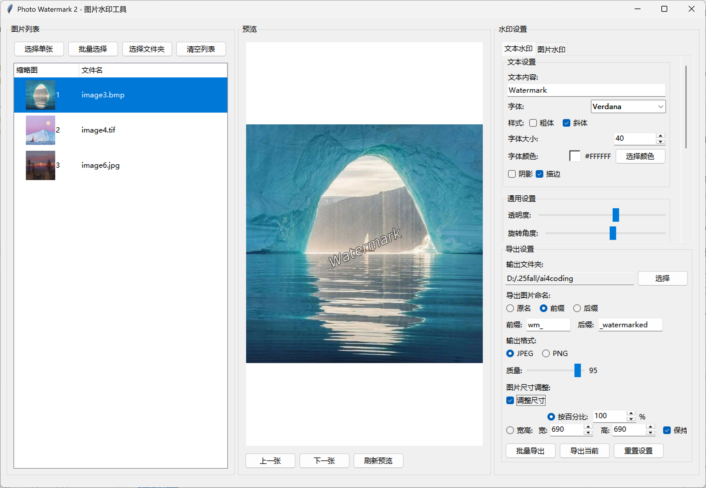
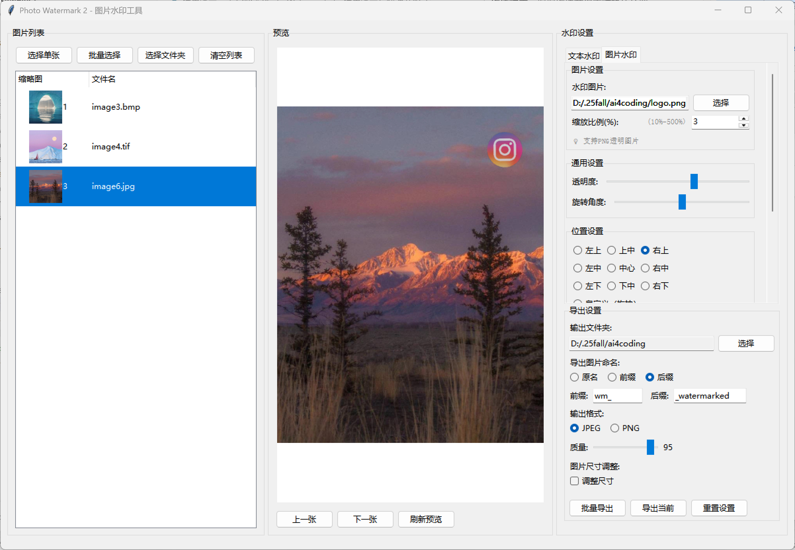

# Photo Watermark 2 - 图片水印工具

> 功能强大的Windows桌面应用程序，为图片批量添加专业水印

## ✨ 特色功能

- 🎨 **双水印系统**：文本水印（PIL）+ 图片水印（OpenCV）
- 🎨 **多格式支持**：JPEG, PNG, BMP, TIFF。PNG格式还支持透明通道，水印处理后透明部分仍然透明 ✅
- 🚀 **高性能处理**：OpenCV加速，批量导出快3倍
- 🖱️ **拖拽操作**：拖拽导入图片，拖拽定位水印
- 💾 **模板管理**：保存常用配置，一键应用
- 🎯 **实时预览**：所见即所得，调整即时生效
- 📦 **批量处理**：一键处理成百上千张图片

## 🎯 核心功能

| 功能 | 说明 |
|------|------|
| **文本水印** | 8种字体、粗体斜体、阴影描边 |
| **图片水印** | PNG透明支持、智能缩放 |
| **批量导入** | 拖拽/选择/文件夹，4种方式 |
| **位置控制** | 九宫格预设 + 鼠标拖拽 |
| **格式支持** | JPEG/PNG/BMP/TIFF输入 |
| **智能导出** | 防覆盖、质量控制、尺寸调整 |

## 技术设计

### 架构设计
```
Photo_Watermark_2/
├── main.py                      # 主应用程序入口
├── image_processor.py           # 图片处理模块
├── text_watermark_manager.py    # 文本水印管理模块（基于PIL）
├── image_watermark_manager.py   # 图片水印管理模块（基于OpenCV）
├── config_manager.py            # 配置管理模块
├── requirements.txt             # 依赖库列表
├── build_exe.py                # Windows可执行文件构建脚本
└── README.md                   # 项目说明文档
```

### 技术栈
- **GUI框架**：tkinter (Python内置，无需额外安装)
- **文本水印**：PIL/Pillow (支持多种字体和样式)
- **图片水印**：OpenCV + NumPy (高性能图片叠加和透明度处理)
- **拖拽支持**：tkinterdnd2 (Windows原生拖拽功能)
- **文件操作**：os, pathlib (标准库)
- **配置存储**：json (标准库)
- **打包工具**：PyInstaller (生成Windows可执行文件)

### 核心模块设计

#### 1. main.py - 主应用程序
- 创建主窗口和界面布局
- 处理用户交互事件
- 协调各模块之间的数据传递
- 实现拖拽导入功能

#### 2. image_processor.py - 图片处理
- 图片导入和格式验证
- 图片格式转换和导出
- 图片尺寸调整和质量控制
- 缩略图生成

#### 3. text_watermark_manager.py - 文本水印管理
- 使用PIL进行文本水印渲染
- 支持自定义字体、大小、颜色
- 支持粗体、斜体、阴影、描边效果
- 水印位置计算和旋转处理

#### 4. image_watermark_manager.py - 图片水印管理
- 使用OpenCV进行图片水印处理
- 支持PNG透明通道
- Alpha混合和透明度控制
- 高性能图片叠加

#### 5. config_manager.py - 配置管理
- 水印模板的保存和加载
- 用户设置的持久化存储
- 默认配置管理

## 🚀 快速开始

### 安装依赖

```bash
pip install -r requirements.txt
```

这将安装：
- `Pillow` - 文本水印渲染
- `opencv-python` - 图片水印处理 
- `numpy` - 数值计算
- `tkinterdnd2` - 拖拽支持
- `pyinstaller` - 打包工具（可选）

### 运行程序

```bash
python main.py
```

### 验证安装

```bash
python test_app.py
```

## 📖 文档导航

| 文档 | 用途 | 适合人群 |
|------|------|---------|
| [使用演示.md](使用演示.md) | 完整教程、技巧、常见问题 | 所有用户 ⭐ |
| [功能清单.md](功能清单.md) | 功能列表、最新更新 | 想了解详情 ⭐ |
| [安装说明.md](安装说明.md) | 详细安装指南、问题解决 | 安装遇到问题 |
| [项目文件说明.md](项目文件说明.md) | 项目结构、文件用途 | 开发者 |

## 💡 快速使用

### 1️⃣ 导入图片
拖拽图片到窗口，或点击"批量选择"按钮

### 2️⃣ 添加水印
- **文本水印**：在"文本水印"标签页输入文字、选择字体
- **图片水印**：在"图片水印"标签页选择Logo图片

### 3️⃣ 调整位置
在预览图上直接拖拽水印到想要的位置

### 4️⃣ 批量导出
选择输出文件夹，点击"批量导出"

详细教程请查看 [使用演示.md](使用演示.md)

## 🔧 打包可执行文件

```bash
python build_exe.py
```

生成文件：
- `dist/PhotoWatermark2.exe` - 单文件版本
- `PhotoWatermark2_Portable/` - 便携版本

## 🆕 亮点

- ✅ **OpenCV图片水印**：性能提升3倍
- ✅ **模块化架构**：文本和图片水印独立管理
- ✅ **缩放滑块**：更直观的尺寸调整
- ✅ **优化布局**：导出设置独立，避免重复
- ✅ **智能默认值**：使用前缀命名，防止覆盖

查看详情：[功能清单.md](功能清单.md)

## 📋 系统要求

- Windows 10/11（推荐）
- Python 3.7+
- 内存 4GB+
- 磁盘空间 150MB+

## 📞 获取帮助

- 💬 使用问题 → [使用演示.md](使用演示.md) 的"常见问题"部分
- 🔧 安装问题 → [安装说明.md](安装说明.md)
- 📚 功能详情 → [功能清单.md](功能清单.md)
- 🏗️ 项目结构 → [项目文件说明.md](项目文件说明.md)

## 效果示例

**文字水印示例图**


**图片水印示例图**


## 📄 许可证

MIT License